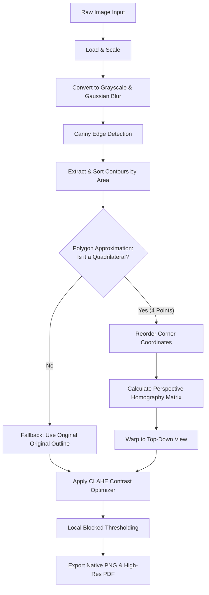

# 📄 Intelligent Document Digitization Pipeline


An advanced, Object-Oriented Computer Vision pipeline that automatically detects, extracts, perspective-warps, and enhances documents from raw photographs. It converts skewed, badly-lit photos of receipts, notes, or documents into clean, flat, high-contrast, universally formatted `.pdf`s and `.png`s.

## ✨ Key Features

- **Adaptive Perspective Transformations**: Automatically locates the mathematical bounds of a paper document and straightens it out using Homography geometry.
- **Advanced CLAHE Contrast Fixes**: Implements *Contrast Limited Adaptive Histogram Equalization* to actively eliminate background shadows before thresholding.
- **Dual Export Options**: Extracts both a native snapshot (`.png`) and fully formatted Portable Document (`.pdf`).
- **Object-Oriented Architecture**: Built using a robust, easily-extensible `DocumentProcessor` class pattern.

## ⚙️ Installation

You will need Python 3 installed. It is recommended to use a virtual environment.

```bash
# Clone the repository
git clone https://github.com/guneet1881/ComputerVisionBYOP.git
cd ComputerVisionBYOP

# Install Required Dependencies
pip install -r requirements.txt
```

## 🚀 Usage

This project is entirely Command-Line-Interface (CLI) driven. Simply provide the path to the raw photo, and specify where you want the scan to be saved.

```bash
python scanner.py --image <path_to_image> --output <path_to_save_directory/output.png>
```

**Example Run:**
```bash
python scanner.py --image images/test_receipt.jpg --output output/scan.png
```
*(The script will automatically generate an `scan.pdf` alongside your `.png` in the output directory!)*

## 🧠 How the Computer Vision Pipeline Works

1. **Pre-Processing & Edge Mapping**: The system loads the unaligned image into memory, squashes the color-space to monochrome, and scrubs micro-grit using Gaussian blurring. It then applies a Canny edge detector to trace geometric ridges.
2. **Boundary Tracing**: Contour algorithms isolate candidate shapes by tracing the active edge map. We sort by geometric area and mathematically approximate bounding vertices until a pure 4-point quadrilateral (the document corners) is isolated.
3. **Birds-Eye Perspective Mapping**: The coordinates of the quadrilateral are fed into `extract_birdseye_view()`, which computes a homographic matrix to "stretch and flatten" the angled document into a perfect, top-down orthogonal frame.
4. **Adaptive Image Enhancement**: Instead of relying heavily on standard Gaussian thresholding which struggles with lighting gradients, the system utilizes CLAHE coupled with local blocked thresholding to recreate a flawless "scanned ink" aesthetic.

### Architecture Flowchart



## 📁 Repository Structure
* `scanner.py` - Core CLI routing and pipeline execution (contains `DocumentProcessor`).
* `transform.py` - Contains the foundational math utility functions for reordering coordinate grids and performing perspective projections.
* `images/` - Directory for test dataset photos.
* `output/` - Target trajectory for finished digitizations.

---
*Created for a Computer Vision Bring-Your-Own-Project (BYOP) assignment.*
